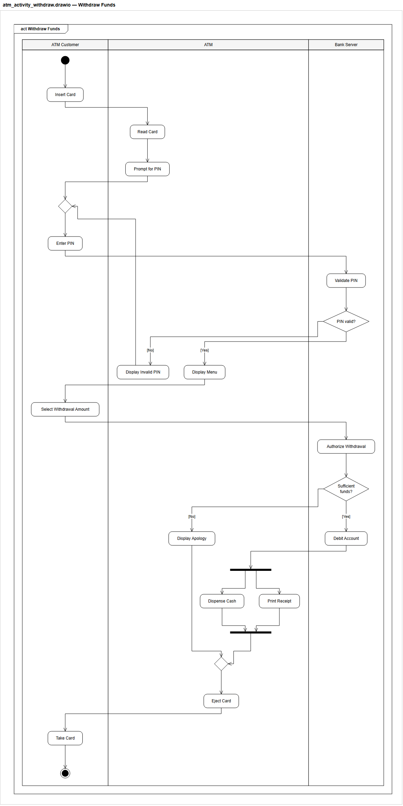
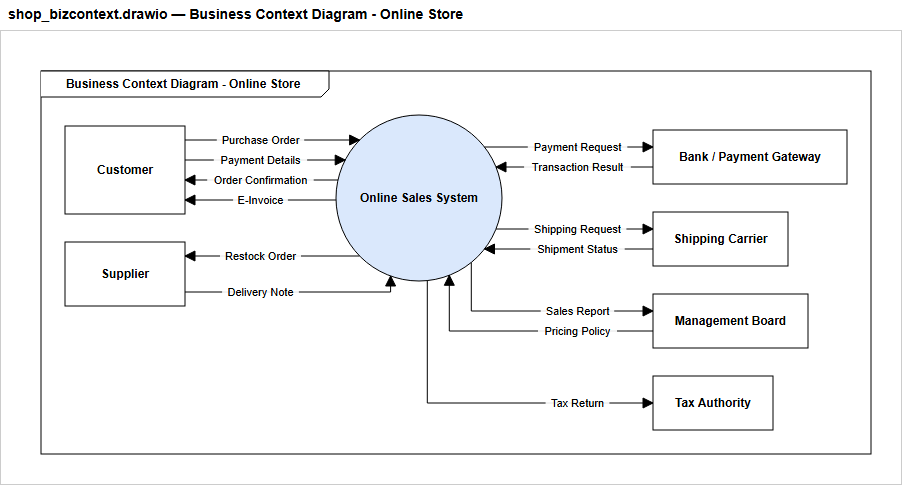
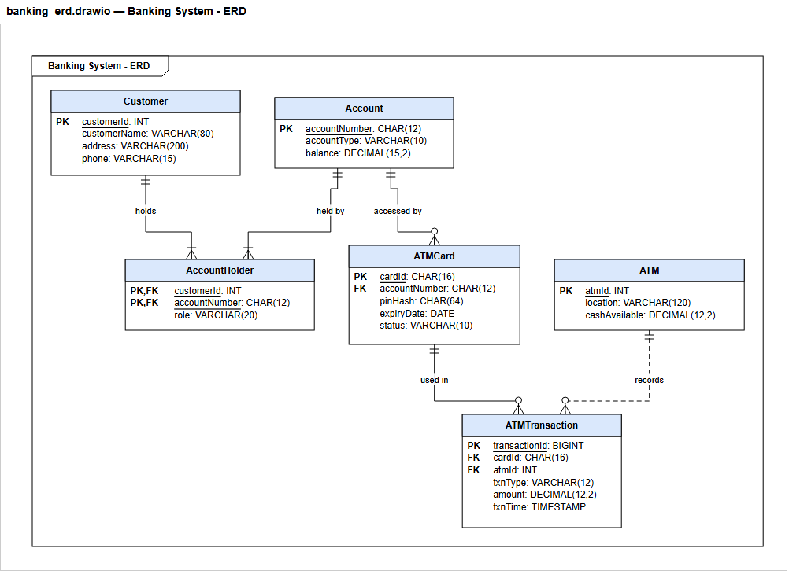
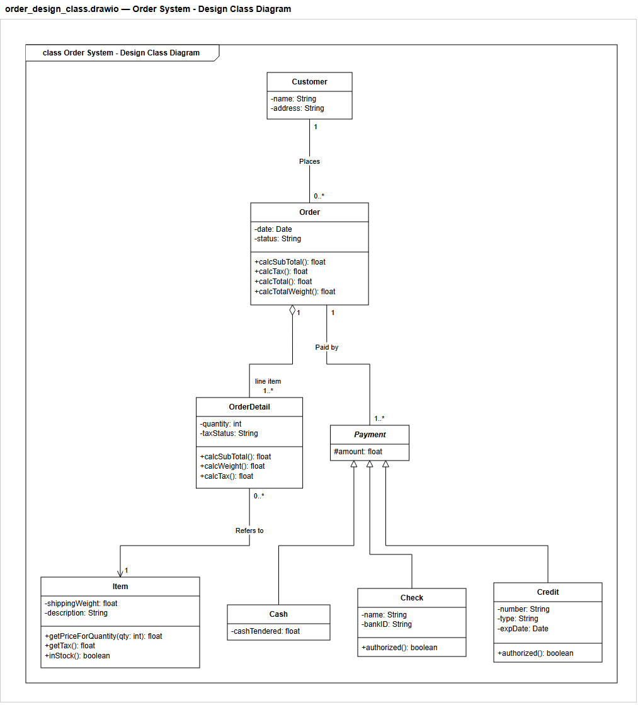
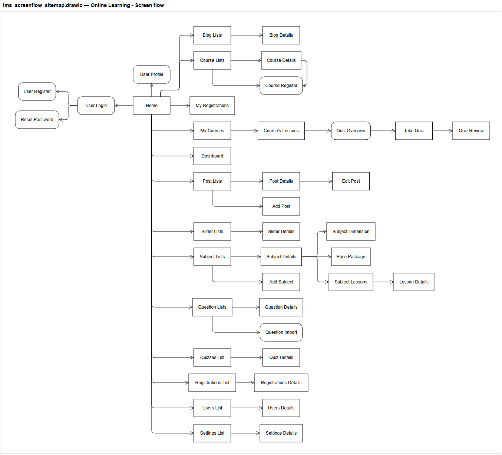
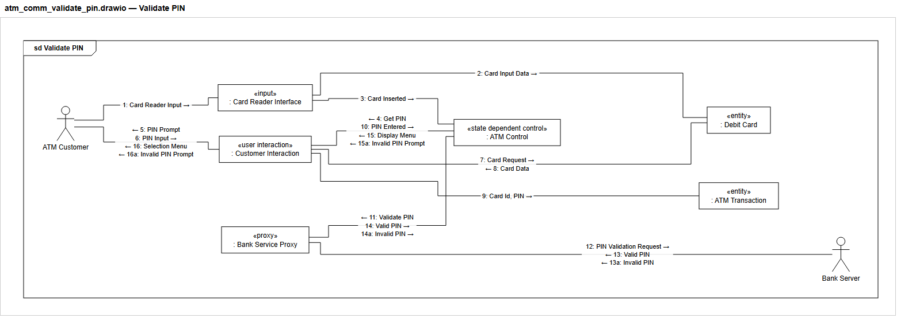
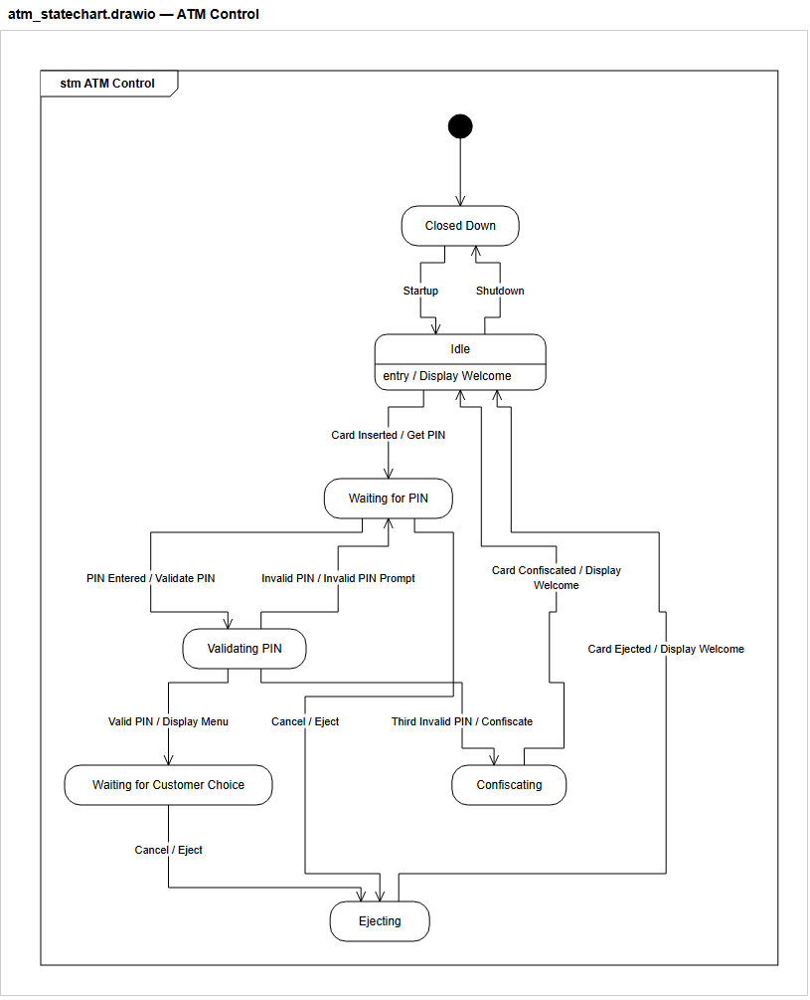

# 🖍️ Bé tập vẽ

**Bộ skill giúp AI (Claude Code, Google Antigravity) vẽ sơ đồ UML đúng cú pháp ra draw.io, theo phương pháp COMET
của Hassan Gomaa, không có hình nào chồng lên hay dính vào nhau.**

AI chỉ cần viết một *spec JSON* mô tả phần tử và quan hệ. Còn lại do script lo hết: bố cục, định tuyến đường nối,
chừa chỗ cho nhãn, sinh file `.drawio`, kiểm tra hình học và kiểm tra luật UML/COMET. Nhờ vậy AI **không bao giờ
phải tự đoán toạ độ**.

<p align="center">
  
  
</p>

---

## Mục lục
1. [Có những sơ đồ nào](#1-có-những-sơ-đồ-nào)
2. [Cài đặt](#2-cài-đặt)
3. [Dùng với Claude Code](#3-dùng-với-claude-code)
4. [Dùng với Google Antigravity](#4-dùng-với-google-antigravity)
5. [Tự chạy tay (không cần AI)](#5-tự-chạy-tay-không-cần-ai)
6. [Viết spec JSON – ví dụ nhanh](#6-viết-spec-json--ví-dụ-nhanh)
7. [Đọc kết quả kiểm tra](#7-đọc-kết-quả-kiểm-tra)
8. [Cấu trúc thư mục](#8-cấu-trúc-thư-mục)
9. [Chạy test](#9-chạy-test)
10. [Xử lý sự cố](#10-xử-lý-sự-cố)

---

## 1. Có những sơ đồ nào

Mỗi loại sơ đồ có một lệnh riêng. Lệnh `/uml-comet` vẽ trọn bộ theo thứ tự COMET vào **một file nhiều trang**.

| Lệnh | Sơ đồ | Ghi chú |
|---|---|---|
| `/uml-usecase` | Use case | actor chính bên trái, actor phụ bên phải, «include»/«extend» |
| `/uml-context` | Context diagram (COMET) | «software system» + các lớp «external input device», «external system»… |
| `/uml-class` | Class / entity class / design class | visibility `+ - # ~`, kiểu, operation, multiplicity, role, chiều điều hướng, aggregation, composition, generalization, lớp trừu tượng |
| `/uml-communication` | Communication (collaboration) | message đánh số, mũi tên hướng tự đặt theo bố cục |
| `/uml-sequence` | Sequence | sync/async/reply/create, fragment `alt`/`opt`/`loop`/`par` |
| `/uml-statechart` | Statechart | composite state, choice, history, `Event [guard] / action` |
| `/uml-activity` | Activity có swimlane | action bo góc, **decision có câu hỏi trong hình thoi**, fork/join |
| `/uml-package` | Package / subsystem | |
| `/uml-component` | Component | provided/required interface dạng lollipop |
| `/uml-deployment` | Deployment | node, device, execution environment, artifact |
| `/uml-erd` | **ERD (chân chim)** | PK/FK, khoá kép, cardinality `1`, `0..1`, `1..*`, `0..*`, identifying / non-identifying |
| `/uml-screenflow` | **Screen flow** | màn hình, dialog, điều hướng `thao tác [điều kiện]`; hoặc **sơ đồ trang (site map)** dạng cây từ Home |
| `/uml-bizcontext` | **Context diagram nghiệp vụ** | hình tròn trung tâm, các bên liên quan xếp vòng quanh, luồng dữ liệu hai chiều |
| `/uml-comet` | Trọn bộ COMET | use case → context → class → communication + sequence → statechart → (activity, package, component, deployment) |

<p align="center">
  
</p>
<p align="center">
  
</p>
<p align="center">
  
</p>
<p align="center">
  
  
</p>

**Được đảm bảo:**
- Không hình nào chồng lên nhau, không đường nối nào cắt ngang qua hình, không hai đường nối trùng lên nhau.
  Validator báo **ERROR** nếu vi phạm, và bộ test chạy fuzz trên hàng trăm spec ngẫu nhiên.
- Ký hiệu UML 2.5 đúng: mũi tên generalization rỗng, «include» nét đứt, choice là hình thoi, final là chấm tròn
  trong vòng tròn…
- Kiểm tra nhất quán COMET giữa các sơ đồ, ví dụ: actor chỉ nói chuyện với đối tượng boundary; event trên
  statechart phải khớp message trong communication diagram.
- Tên tiếng Việt có dấu hiển thị đúng.

---

## 2. Cài đặt

**Cần có:** Python 3 (đã thử với 3.13, không cần thư viện ngoài). Để AI mở sơ đồ thẳng trên draw.io thì cài thêm Node.js và draw.io MCP
(không bắt buộc).

```bash
git clone https://github.com/Shaichi/be-tap-ve.git
```

```bash
python be-tap-ve/comet-uml-drawio/scripts/install.py
```

Script cài chép engine vào `~/.claude/skills/comet-uml-drawio/`. Mỗi lệnh được chép thành
`~/.claude/skills/uml-*/SKILL.md`, đã thay đường dẫn engine tuyệt đối. Nếu máy có `~/.gemini/config`
(Antigravity), bộ skill cũng được cài vào `~/.gemini/config/skills/`.

| Tuỳ chọn | Tác dụng |
|---|---|
| `--dest D:/skills` | cài vào thư mục khác (lặp lại được) |
| `--dry-run` | chỉ in ra những việc sẽ làm |
| `--uninstall` | gỡ engine và các lệnh đã cài |

Script chỉ ghi đè hoặc xoá thư mục thuộc bộ skill này: nó nhận ra qua `name:` trong `SKILL.md`. Skill khác trùng tên
sẽ được giữ nguyên.

Cập nhật: `git pull` rồi chạy lại `install.py`.

### Cài draw.io MCP (tuỳ chọn)

Claude Code:
```bash
claude mcp add drawio -- npx -y @drawio/mcp
```

Antigravity: thêm vào `~/.gemini/config/mcp_config.json`:
```json
{ "mcpServers": { "drawio": { "command": "npx", "args": ["-y", "@drawio/mcp"] } } }
```
Sau đó mở *Manage MCP Servers › Refresh*. Trên Windows, nếu server không chạy, hãy ghi đường dẫn tuyệt đối tới
`npx.cmd`. Chi tiết xem [`references/drawio-mcp.md`](comet-uml-drawio/references/drawio-mcp.md).

---

## 3. Dùng với Claude Code

Mở phiên mới sau khi cài để Claude nạp skill, rồi gõ lệnh kèm mô tả:

```text
/uml-usecase Hệ thống thư viện: độc giả mượn/trả sách, thủ thư quản lý sách, hệ thống email gửi nhắc hạn
/uml-activity Quy trình rút tiền ATM, 3 làn: Khách hàng, ATM, Ngân hàng
/uml-erd Cơ sở dữ liệu bán hàng: khách hàng, đơn hàng, chi tiết đơn, sản phẩm, danh mục
/uml-screenflow Luồng đăng ký tài khoản và đăng nhập của app đặt đồ ăn
/uml-screenflow Sơ đồ trang (site map) hệ thống học trực tuyến: Home, đăng nhập, khoá học, bài viết, quản trị
/uml-bizcontext Cửa hàng trực tuyến: khách hàng, nhà cung cấp, ngân hàng, đơn vị vận chuyển, cơ quan thuế
/uml-comet Hệ thống ATM của ngân hàng (đủ 10 bước)
```

Nói tự nhiên cũng được, ví dụ "vẽ class diagram cho hệ thống quản lý khách sạn". Skill gốc `comet-uml-drawio` sẽ
tự chọn đúng lệnh.

**AI sẽ làm theo quy trình cố định:**
1. Đọc ví dụ mẫu và quy tắc của loại sơ đồ.
2. Viết spec vào `./uml/<tên>.json`.
3. Chạy `uml2drawio.py` (sinh file và kiểm tra hình học), rồi `comet_check.py` (luật UML/COMET), rồi
   `preview_svg.py --png` (chụp ảnh).
4. Sửa đến khi **0 ERROR** và hết WARN, rồi tự xem ảnh để soát lại.
5. Nếu có draw.io MCP: mở sơ đồ trên diagrams.net. Nếu không: đưa đường dẫn file `.drawio` và `.png`.

Kết quả nằm trong `./uml/` của thư mục làm việc. File `.drawio` mở được bằng draw.io desktop, diagrams.net hoặc
extension draw.io của VS Code.

---

## 4. Dùng với Google Antigravity

`install.py` tự cài vào `~/.gemini/config/skills/` khi có thư mục `~/.gemini/config`. Trong Antigravity (IDE hoặc CLI),
cứ yêu cầu bình thường: agent tự chọn skill theo phần mô tả. Muốn chắc chắn thì gọi tên lệnh:

```text
Dùng skill uml-erd vẽ ERD cho hệ thống quản lý thư viện
Dùng skill uml-comet vẽ trọn bộ COMET cho ứng dụng giao đồ ăn
```

---

## 5. Tự chạy tay (không cần AI)

```bash
cd be-tap-ve/comet-uml-drawio
```

```bash
python scripts/uml2drawio.py examples/banking_erd.json -o out/banking_erd.drawio
```

```bash
python scripts/comet_check.py --partial examples/banking_erd.json
```

```bash
python scripts/preview_svg.py out/banking_erd.drawio -o out/banking_erd.html --png
```

Gộp nhiều spec thành một file nhiều trang (glob để trong ngoặc kép, chạy được cả trên PowerShell/cmd):

```bash
python scripts/uml2drawio.py "examples/atm_*.json" -o out/atm_all.drawio
```

Tuỳ chọn khác:
- `--xml-only` chỉ in `<mxGraphModel>` (để đưa vào MCP `set_page`).
- `--no-validate` bỏ bước kiểm tra.
- `python scripts/validate_drawio.py file.drawio` kiểm tra một file draw.io bất kỳ, kể cả file vẽ tay.

**Mã thoát:** `0` là sạch; `2` là còn ERROR.

---

## 6. Viết spec JSON – ví dụ nhanh

**Activity có swimlane** (decision ghi câu hỏi, guard là câu trả lời):
```json
{
  "diagram": "activity", "title": "Rút tiền", "partitions": ["Khách hàng", "ATM"],
  "elements": [
    {"id": "s", "type": "initial", "partition": "Khách hàng"},
    {"id": "a", "type": "action", "name": "Nhập số tiền", "partition": "Khách hàng"},
    {"id": "d", "type": "decision", "question": "Đủ số dư?", "partition": "ATM"},
    {"id": "b", "type": "action", "name": "Nhả tiền", "partition": "ATM"},
    {"id": "e", "type": "action", "name": "Báo lỗi", "partition": "ATM"},
    {"id": "m", "type": "merge", "partition": "ATM"},
    {"id": "f", "type": "activityFinal", "partition": "ATM"}
  ],
  "relations": [
    {"from": "s", "to": "a"}, {"from": "a", "to": "d"},
    {"from": "d", "to": "b", "guard": "Có"}, {"from": "d", "to": "e", "guard": "Không"},
    {"from": "b", "to": "m"}, {"from": "e", "to": "m"}, {"from": "m", "to": "f"}
  ]
}
```

**Design class diagram** (visibility `+ - # ~`, kiểu, operation, role, chiều điều hướng, lớp trừu tượng):
```json
{
  "diagram": "class", "title": "Đặt hàng",
  "elements": [
    {"id": "ord", "type": "class", "name": "Order",
     "attributes": ["-date: Date", "-status: String"], "operations": ["+calcTotal(): float"]},
    {"id": "od", "type": "class", "name": "OrderDetail",
     "attributes": ["-quantity: int"], "operations": ["+calcSubTotal(): float"]},
    {"id": "item", "type": "class", "name": "Item",
     "attributes": ["-description: String"], "operations": ["+getPriceForQuantity(qty: int): float"]},
    {"id": "pay", "type": "class", "name": "Payment", "abstract": true, "attributes": ["#amount: float"]},
    {"id": "cash", "type": "class", "name": "Cash", "attributes": ["-cashTendered: float"]}
  ],
  "relations": [
    {"type": "aggregation", "from": "ord", "to": "od", "fromMult": "1", "toMult": "1..*", "toRole": "line item"},
    {"type": "association", "from": "od", "to": "item", "label": "Refers to",
     "fromMult": "0..*", "toMult": "1", "navigable": true},
    {"type": "association", "from": "ord", "to": "pay", "label": "Paid by", "fromMult": "1", "toMult": "1..*"},
    {"type": "generalization", "from": "cash", "to": "pay"}
  ]
}
```

**ERD:**
```json
{
  "diagram": "erd", "title": "Bán hàng",
  "elements": [
    {"id": "kh", "type": "entity", "name": "KhachHang", "attributes": ["PK maKH: INT", "hoTen: NVARCHAR(80)"]},
    {"id": "dh", "type": "entity", "name": "DonHang", "attributes": ["PK maDH: INT", "FK maKH: INT", "ngayDat: DATE"]}
  ],
  "relations": [
    {"type": "relationship", "from": "kh", "to": "dh", "fromCard": "1", "toCard": "0..*", "label": "đặt"}
  ]
}
```

**Context diagram nghiệp vụ:**
```json
{
  "diagram": "bizcontext", "title": "Cửa hàng",
  "elements": [
    {"id": "shop", "type": "system", "name": "Hệ thống bán hàng"},
    {"id": "kh", "type": "external", "name": "Khách hàng"},
    {"id": "nh", "type": "external", "name": "Ngân hàng"}
  ],
  "relations": [
    {"from": "kh", "to": "shop", "label": "Đơn đặt hàng"},
    {"from": "shop", "to": "kh", "label": "Hoá đơn"},
    {"from": "shop", "to": "nh", "label": "Yêu cầu thanh toán"},
    {"from": "nh", "to": "shop", "label": "Kết quả giao dịch"}
  ]
}
```

Đặc tả đầy đủ các trường: [`references/spec-format.md`](comet-uml-drawio/references/spec-format.md). Ký hiệu UML:
[`references/uml-notation.md`](comet-uml-drawio/references/uml-notation.md). Phương pháp COMET và bảng luật kiểm
tra: [`references/comet-method.md`](comet-uml-drawio/references/comet-method.md). Ví dụ mẫu cho mọi loại sơ đồ
(hệ ATM/Banking của Gomaa): [`examples/`](comet-uml-drawio/examples).

---

## 7. Đọc kết quả kiểm tra

| Mức | Ý nghĩa | Phải làm gì |
|---|---|---|
| **ERROR** | Sai thật: hình chồng nhau, đường cắt qua hình, tham chiếu phần tử không tồn tại, vi phạm UML nặng | Bắt buộc sửa. Mã thoát `2` |
| **WARN** | Nhiều khả năng sai: nhãn bị đè, thiếu guard, entity chưa có khoá chính, màn hình không tới được… | Nên sửa hết; chỉ giữ lại khi có lý do rõ ràng |
| **INFO** | Gợi ý: quan hệ nhiều–nhiều nên tách bảng, điều hướng thiếu thao tác kích hoạt… | Tham khảo |

Nhóm luật của `comet_check.py`:

| Mã | Phạm vi |
|---|---|
| R1–R14 | Nhất quán COMET giữa các sơ đồ (use case ↔ tương tác ↔ statechart ↔ context ↔ class) |
| S1–S5 | Statechart hợp lệ |
| A1–A6 | Activity hợp lệ (guard, fork/join, không join ngầm trên action…) |
| C1–C2 | Class diagram (kiểu thuộc tính, multiplicity) |
| E1–E3 | ERD (khoá chính, cardinality, nhiều–nhiều) |
| F1–F2 | Screen flow (màn hình tới được, có thao tác kích hoạt; site map bỏ qua F2 vì mũi tên không nhãn) |
| B1–B3 | Context nghiệp vụ (1 trung tâm, luồng có tên, không luồng giữa hai bên ngoài) |

`--partial`: dùng khi mới vẽ một phần của bộ sơ đồ. Khi đó các luật "thiếu sơ đồ tương ứng" (R1, R7) chỉ còn là
INFO.

---

## 8. Cấu trúc thư mục

```text
be-tap-ve/
├── README.md                  ← file này
├── docs/img/                  ← ảnh minh hoạ trong README
└── comet-uml-drawio/          ← skill gốc (engine)
    ├── SKILL.md               ← mô tả skill + quy trình cho AI
    ├── commands/uml-*/        ← 14 lệnh, mỗi lệnh 1 SKILL.md (placeholder <ENGINE>)
    ├── scripts/
    │   ├── uml2drawio.py      ← spec JSON → .drawio (bố cục + sinh XML + tự kiểm tra)
    │   ├── validate_drawio.py ← kiểm tra hình học: chồng hình, đường cắt hình, nhãn đè
    │   ├── comet_check.py     ← kiểm tra luật UML/COMET trên spec
    │   ├── preview_svg.py     ← .drawio → HTML/SVG/PNG để xem nhanh
    │   ├── install.py         ← cài vào Claude Code / Antigravity
    │   └── mcp_smoke.py       ← thử draw.io MCP server
    ├── references/            ← spec-format, uml-notation, comet-method, drawio-mcp
    ├── examples/              ← 15 spec mẫu (ATM/Banking, cửa hàng trực tuyến)
    └── tests/                 ← run_tests.py + fuzz_specs.py
```

---

## 9. Chạy test

```bash
python comet-uml-drawio/tests/run_tests.py
```

Bộ test gồm 77 test: validator, generator của từng loại sơ đồ, luật `comet_check`, CLI, cài/gỡ, tài liệu khớp
với code, và fuzz trên spec ngẫu nhiên. Các biến môi trường điều chỉnh:
- `COMET_FUZZ_SEEDS=300`: số spec fuzz (mặc định 80).
- `COMET_TEST_PNG=0`: bỏ test xuất PNG.

---

## 10. Xử lý sự cố

| Hiện tượng | Cách xử lý |
|---|---|
| `UnicodeEncodeError` khi in tiếng Việt trên Windows | Đặt `PYTHONIOENCODING=utf-8` hoặc chạy trong Windows Terminal |
| Gõ `/uml-…` mà không thấy lệnh | Chạy lại `install.py`, rồi **mở phiên mới** |
| AI không mở được sơ đồ trên draw.io | Kiểm tra MCP (`claude mcp list`). Không có MCP thì mở file `.drawio` bằng tay |
| Sơ đồ bị xô lệch sau khi mở trên draw.io | Đừng bật `postLayout`/auto-layout của draw.io: bố cục đã được tính sẵn |
| `--png` không ra ảnh | Cần có Chrome/Edge để chụp ảnh; file `.html` vẫn xem được trên trình duyệt |
| Có WARN mà muốn giữ nguyên | Được, nhưng ghi rõ mã luật và lý do. Đừng bỏ qua ERROR |

---

**Tài liệu tham khảo:** H. Gomaa, *Software Modeling and Design: UML, Use Cases, Patterns, and Software
Architectures*, Cambridge University Press, 2011; OMG UML 2.5.1.
