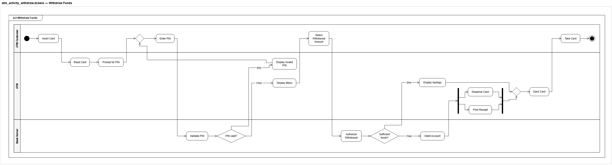
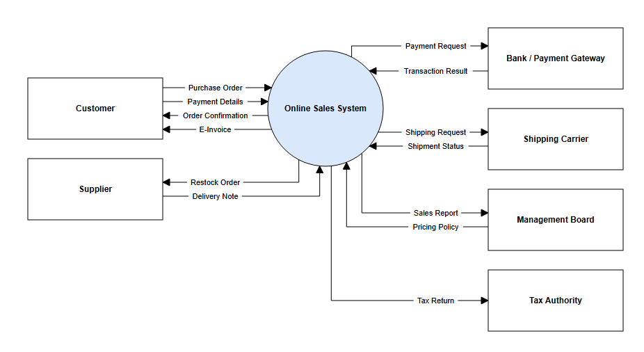
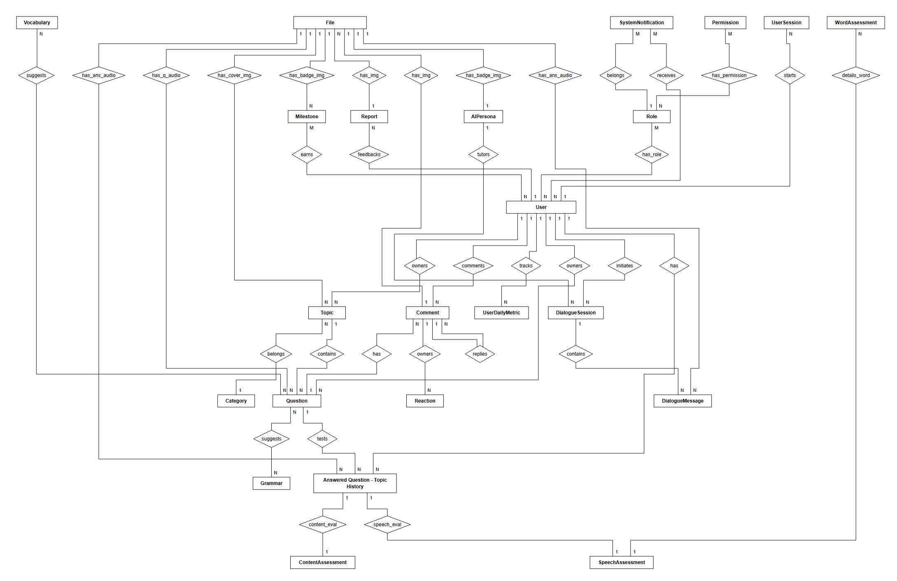
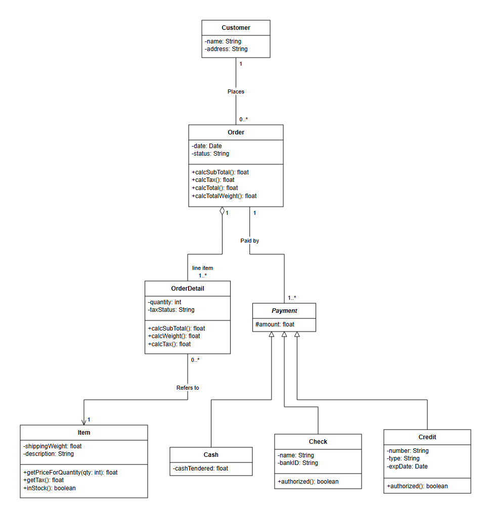
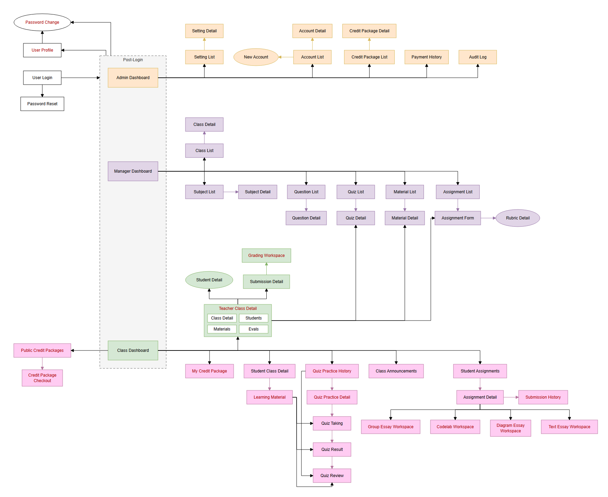
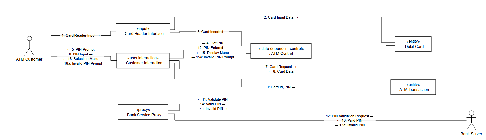
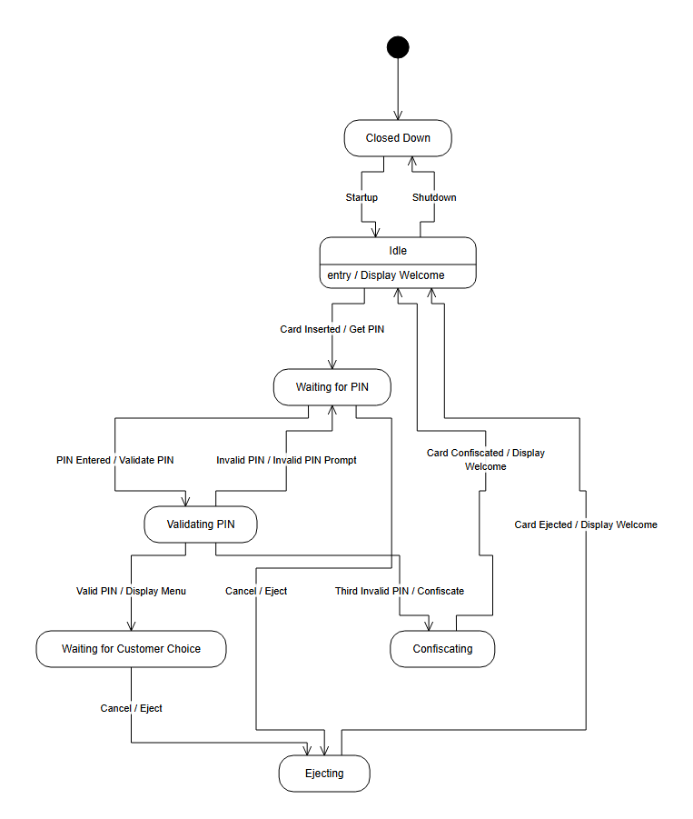
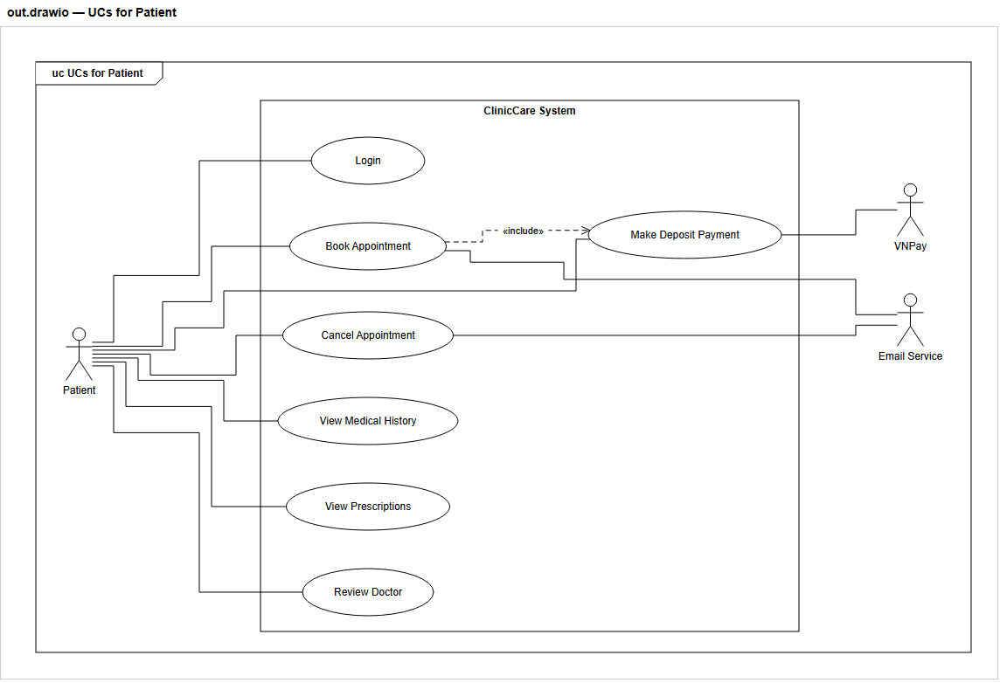
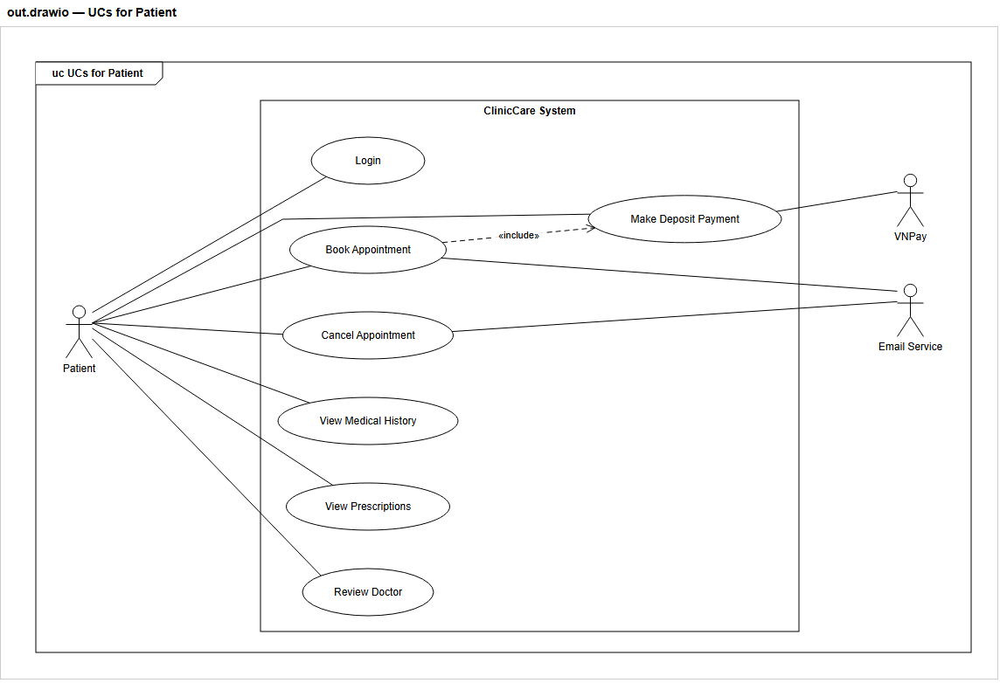

# 🖍️ Bé tập vẽ

**Bộ skill giúp AI (Claude Code, Google Antigravity) vẽ sơ đồ UML đúng cú pháp ra draw.io, theo phương pháp COMET
của Hassan Gomaa, không có hình nào chồng lên hay dính vào nhau.**

AI chỉ cần viết một *spec JSON* mô tả phần tử và quan hệ. Còn lại do script lo hết: bố cục, định tuyến đường nối,
chừa chỗ cho nhãn, sinh file `.drawio`, kiểm tra hình học và kiểm tra luật UML/COMET. Nhờ vậy AI **không bao giờ
phải tự đoán toạ độ**.

<p align="center">
  
</p>
<p align="center">
  
</p>

---

## Mục lục
1. [Có những sơ đồ nào](#1-có-những-sơ-đồ-nào)
   - [`/uml-comet` được cải tiến những gì](#uml-comet-được-cải-tiến-những-gì)
2. [Cài đặt](#2-cài-đặt)
3. [Dùng với Claude Code](#3-dùng-với-claude-code)
   - [Cách dùng `/uml-comet` từng bước](#cách-dùng-uml-comet-từng-bước)
4. [Dùng với Google Antigravity](#4-dùng-với-google-antigravity)
5. [Tự chạy tay (không cần AI)](#5-tự-chạy-tay-không-cần-ai)
6. [Viết spec JSON – ví dụ nhanh](#6-viết-spec-json--ví-dụ-nhanh)
7. [Đọc kết quả kiểm tra](#7-đọc-kết-quả-kiểm-tra)
8. [Cấu trúc thư mục](#8-cấu-trúc-thư-mục)
9. [Chạy test](#9-chạy-test)
10. [Xử lý sự cố](#10-xử-lý-sự-cố)

---

## 1. Có những sơ đồ nào

Mỗi loại sơ đồ có một lệnh riêng. Lệnh `/uml-comet` vẽ trọn bộ theo thứ tự COMET vào **một file nhiều trang**.

| Lệnh | Sơ đồ | Ghi chú |
|---|---|---|
| `/uml-usecase` | Use case | actor chính bên trái, actor phụ bên phải, «include»/«extend», đường nối thẳng |
| `/uml-context` | Context diagram (COMET) | «software system» + các lớp «external input device», «external system»… |
| `/uml-class` | Class / entity class / design class | visibility `+ - # ~`, kiểu, operation, multiplicity, role, chiều điều hướng, aggregation, composition, generalization, lớp trừu tượng |
| `/uml-communication` | Communication (collaboration) | message đánh số, mũi tên hướng tự đặt theo bố cục |
| `/uml-sequence` | Sequence | sync/async/reply/create, fragment `alt`/`opt`/`loop`/`par` |
| `/uml-statechart` | Statechart | composite state, choice, history, `Event [guard] / action` |
| `/uml-activity` | Activity có swimlane | mặc định vẽ ngang (luồng trái→phải, làn xếp trên→dưới), gọn (action hẹp, tên dài xuống dòng), action bo góc, **decision có câu hỏi trong hình thoi**, fork/join |
| `/uml-package` | Package / subsystem | |
| `/uml-component` | Component | provided/required interface dạng lollipop |
| `/uml-deployment` | Deployment | node, device, execution environment, artifact |
| `/uml-erd` | **ERD (Chen hoặc crow's foot)** | Chen: thực thể chữ nhật + hình thoi quan hệ có tên, bản số `1` / `N` / `M`, quan hệ đệ quy, bậc 3. Crow's foot (`"notation": "crowfoot"`): ERD khái niệm (`entity`) và ERD vật lý (`table` + cột PK/FK) |
| `/uml-screenflow` | **Screen flow theo vai trò** | Login → nhóm Post-Login nét đứt chứa các dashboard, mỗi dashboard toả dải màn hình (List → Detail thẳng hàng), màu theo vai trò, popup ellipse, mũi tên đặc không nhãn (không có nhóm → cây site map) |
| `/uml-bizcontext` | **Context diagram nghiệp vụ** | hình tròn trung tâm, các bên liên quan xếp 2 cột trái/phải, mỗi luồng dữ liệu một mũi tên vuông góc, tên luồng nằm ngang |
| `/uml-comet` | Trọn bộ COMET | use case → context → class → communication + sequence → statechart → (activity, package, component, deployment) |

<p align="center">
  
</p>
<p align="center">
  
</p>
<p align="center">
  
</p>
<p align="center">
  
  
</p>

**Được đảm bảo:**
- Không hình nào chồng lên nhau, không đường nối nào cắt ngang qua hình, không hai đường nối trùng lên nhau.
  Validator báo **ERROR** nếu vi phạm, và bộ test chạy fuzz trên hàng trăm spec ngẫu nhiên.
- Ký hiệu UML 2.5 đúng: mũi tên generalization rỗng, «include» nét đứt, choice là hình thoi, final là chấm tròn
  trong vòng tròn…
- Kiểm tra nhất quán COMET giữa các sơ đồ, ví dụ: actor chỉ nói chuyện với đối tượng boundary; event trên
  statechart phải khớp message trong communication diagram.
- Chữ trên sơ đồ mặc định tiếng Anh; yêu cầu tiếng Việt thì tên có dấu vẫn hiển thị đúng.

### `/uml-comet` được cải tiến những gì

Bản đầu, `/uml-comet` chỉ vẽ lần lượt từng sơ đồ COMET rồi gộp vào một file. Mỗi sơ đồ đúng một mình, nhưng giữa các
sơ đồ dễ lệch tên. Bản hiện tại coi cả bộ sơ đồ là **một mô hình** và kiểm tra chéo giữa chúng:

| Cải tiến | Trước | Bây giờ |
|---|---|---|
| **Nhất quán giữa các sơ đồ** | Chỉ R1–R14 (use case ↔ tương tác ↔ statechart) | Thêm X1–X12: use case ↔ activity/sequence, entity ↔ bảng ERD, lớp ↔ lifeline, message ↔ operation, thuộc tính ↔ cột, cột FK ↔ thuộc tính quan hệ, lớp ↔ package; R15: mỗi lời gọi `sync` có `reply` |
| **Cô lập hệ thống** | Hai hệ thống trùng tên use case bị trộn lẫn | Khoá `"bundle"` làm namespace; `--strict` coi WARN là lỗi (dùng cho CI) |
| **Mô hình ngữ nghĩa** | Không có | `comet_model.py` gom mọi spec thành model v2 (concept, alias, quan hệ, provenance, impact graph); `comet_plan.py` sinh repair plan (luật → concept → sơ đồ bị ảnh hưởng → cách sửa); `comet_manifest.py` sinh cả ba cùng một `modelFingerprint` |
| **Một nguồn sự thật** | Đổi tên một use case phải sửa tay nhiều spec | `comet_project.py bootstrap` gom thành một file canonical, `compile` sinh lại mọi spec: đổi tên một chỗ, mọi sơ đồ đổi theo; `compile --check` bắt spec bị sửa tay |
| **Hồ sơ SEP490 (FPT capstone)** | Không có | Bảng ánh xạ từng mục Report 3 SRS + Report 4 SDS sang sơ đồ; ERD crow's foot khái niệm + vật lý; class/sequence mức thiết kế (`"level": "design"`) theo Spring Boot phân tầng + React + PostgreSQL (+ Flutter) |
| **Kiểm độ đủ theo template** | Không có | `--profile sep490` với P1–P15: thiếu mục, actor chưa có "UCs for", < 2 bộ code design, thiếu auth flow, entity chưa có bảng, state ≠ giá trị cột `status`, BF/sequence đổi trạng thái không khớp statechart, sequence thiếu use case «include»… |
| **Data dictionary** | Viết tay, dễ lệch sơ đồ | `comet_datadict.py` sinh từ ERD vật lý |
| **Tiết kiệm token** | AI hay mở file sinh ra (model vài MB) | Kỷ luật đọc file: chỉ đọc output lệnh và spec đang sửa; bộ SEP490 chia hai phiên SRS / SDS, quyết định ghi vào `./uml/NOTES.md` |
| **Bố cục use case** | Actor → use case được «include» và use case → actor phụ bên phải hay cắt nhau; đường nối bẻ vuông | Chuỗi cạnh dài được chèn lại vào vị trí ít giao cắt nhất; **đường nối thẳng** (chỉ gập một góc khi phải vòng qua hình), chọn đường ít cắt nhau, không đè hình, tên actor hay nhãn «include»/«extend» |
| **Activity** | Mặc định vẽ dọc | Mặc định vẽ **ngang** (`"direction": "LR"`), gọn: action hẹp (tên dài xuống dòng), đường nối giữa hai cột ngắn lại (ngắn hơn ~20%); ghi `"direction": "TB"` nếu muốn dọc |

Ví dụ bố cục use case (actor phụ bên phải + «include»), trước và sau khi sửa: cạnh *Book Appointment → Email
Service* không còn cắt cạnh *Patient → Make Deposit Payment*, mọi đường nối là đoạn thẳng.

<p align="center">
  
  
</p>

---

## 2. Cài đặt

**Cần có:** Python 3 (đã thử với 3.13, không cần thư viện ngoài). Để AI mở sơ đồ thẳng trên draw.io thì cài thêm Node.js và draw.io MCP
(không bắt buộc).

```bash
git clone https://github.com/Shaichi/be-tap-ve.git
```

```bash
python be-tap-ve/comet-uml-drawio/scripts/install.py
```

Script cài chép engine vào `~/.claude/skills/comet-uml-drawio/`. Mỗi lệnh được chép thành
`~/.claude/skills/uml-*/SKILL.md`, đã thay đường dẫn engine tuyệt đối. Nếu máy có `~/.gemini/config`
(Antigravity), bộ skill cũng được cài vào `~/.gemini/config/skills/`.

| Tuỳ chọn | Tác dụng |
|---|---|
| `--dest D:/skills` | cài vào thư mục khác (lặp lại được) |
| `--dry-run` | chỉ in ra những việc sẽ làm |
| `--uninstall` | gỡ engine và các lệnh đã cài |

Script chỉ ghi đè hoặc xoá thư mục thuộc bộ skill này: nó nhận ra qua `name:` trong `SKILL.md`. Skill khác trùng tên
sẽ được giữ nguyên.

Cập nhật: `git pull` rồi chạy lại `install.py`.

### Cài draw.io MCP (tuỳ chọn)

Claude Code:
```bash
claude mcp add drawio -- npx -y @drawio/mcp
```

Antigravity: thêm vào `~/.gemini/config/mcp_config.json`:
```json
{ "mcpServers": { "drawio": { "command": "npx", "args": ["-y", "@drawio/mcp"] } } }
```
Sau đó mở *Manage MCP Servers › Refresh*. Trên Windows, nếu server không chạy, hãy ghi đường dẫn tuyệt đối tới
`npx.cmd`. Chi tiết xem [`references/drawio-mcp.md`](comet-uml-drawio/references/drawio-mcp.md).

---

## 3. Dùng với Claude Code

Mở phiên mới sau khi cài để Claude nạp skill, rồi gõ lệnh kèm mô tả:

```text
/uml-usecase Hệ thống thư viện: độc giả mượn/trả sách, thủ thư quản lý sách, hệ thống email gửi nhắc hạn
/uml-activity Quy trình rút tiền ATM, 3 làn: Khách hàng, ATM, Ngân hàng
/uml-erd App học tiếng Anh: User, Role, Topic, Question, Comment (bình luận trả lời nhau), File đính kèm
/uml-screenflow Hệ thống học trực tuyến: đăng nhập, Admin / Manager / Teacher / Student dashboard, khoá học, quiz, bài tập
/uml-bizcontext Cửa hàng trực tuyến: khách hàng, nhà cung cấp, ngân hàng, đơn vị vận chuyển, cơ quan thuế
/uml-comet Hệ thống ATM của ngân hàng (đủ 10 bước)
/uml-comet SEP490 TalentHub: vẽ đủ sơ đồ cho Report 3 (SRS) và Report 4 (SDS)
```

**Hồ sơ SEP490 (Report 3 SRS + Report 4 SDS):** `/uml-comet` có sẵn bảng ánh xạ từng mục của template sang sơ đồ
(mục 2b trong `commands/uml-comet/SKILL.md`):

| Tài liệu | Mục | Sơ đồ |
|---|---|---|
| SRS | I.1 Context | `bizcontext` |
| SRS | I.2 Business Flows | `activity` swimlane ngang (`"direction": "LR"`, làn actor + System) |
| SRS | I.3.1 Conceptual ERD | `erd` crow's foot (`"notation": "crowfoot"`, entity) |
| SRS | I.4.3 Use Case Diagrams | `usecase`, mỗi actor một trang "UCs for <Actor>" |
| SRS | I.5.1a Screen Flow | `screenflow` |
| SDS | I.1 Software Architecture | `component` (tier = component `subsystem` chứa component con) |
| SDS | I.2 Package Diagram | `package` |
| SDS | I.3 Database Design | `erd` crow's foot vật lý (`table` + `columns` PK/FK, `entity` trỏ về ERD khái niệm) |
| SDS | II. Code Designs | `class` + `sequence` `"level": "design"` cho từng use case (sequence có `activations`) |
| SDS | III.1.1 Authentication Flow | `sequence` `"level": "design"` |

Stack mặc định khi vẽ SDS: **Spring Boot phân tầng** (Controller → Service/ServiceImpl → Repository `JpaRepository`,
Entity, DTO, Spring Security + JWT), **React** web, **PostgreSQL**; có giao diện điện thoại thì thêm **Flutter** (client
trong kiến trúc, trang Mobile Screen Flow riêng). Nêu stack khác trong prompt để skill ánh xạ lại tầng.

Kết quả gom thành `<Hệ thống>_SRS.drawio` và `<Hệ thống>_SDS.drawio` (mỗi mục một trang); `comet_check.py` chạy
trên cả hai bộ cùng lúc để bắt lệch tên giữa SRS và SDS (X7, X8, R1…). Thêm `--profile sep490` để kiểm **độ đủ**
theo template (P1–P15): thiếu mục nào, actor nào chưa có "UCs for", < 2 bộ code design, thiếu auth flow, entity chưa
có bảng, entity có `status` chưa có statechart, kiến trúc dùng stereotype COMET, dashboard vào được không qua Login, state lệch giá trị cột `status`, bước BF/sequence đổi trạng thái không khớp event của statechart hoặc không kiểm trạng thái nguồn, sequence thiếu use case «include» hay entity con 1..N…
đều thành WARN. Data dictionary **sinh** từ ERD vật lý, không viết tay (sửa spec → chạy lại):

```bash
python comet-uml-drawio/scripts/comet_check.py --strict --profile sep490 "./uml/*.json"
python comet-uml-drawio/scripts/comet_datadict.py ./uml/sds_03_database.json -o ./uml/<He_thong>_DataDictionary.md
```

Bộ SEP490 đầy đủ nên làm **hai phiên**: phiên 1 vẽ SRS (kiểm `--partial` trên `srs_*.json`, ghi quyết định vào
`./uml/NOTES.md`), phiên mới vẽ SDS và kiểm cả bộ không `--partial`. Tính nhất quán nằm ở spec JSON + checker nên phiên
ngắn không mất gì mà AI ít quên ràng buộc hơn. AI chỉ đọc output lệnh và spec đang sửa, **không** mở các file sinh ra
(`*.model.json` vài MB, `*.drawio`, `*.html`…) để khỏi đốt token.

Nói tự nhiên cũng được, ví dụ "vẽ class diagram cho hệ thống quản lý khách sạn". Skill gốc `comet-uml-drawio` sẽ
tự chọn đúng lệnh.

**AI sẽ làm theo quy trình cố định:**
1. Đọc ví dụ mẫu và quy tắc của loại sơ đồ.
2. Viết spec vào `./uml/<tên>.json`.
3. Chạy `uml2drawio.py` (sinh file và kiểm tra hình học), rồi `comet_model.py` (xây canonical semantic model v2),
   `comet_check.py` (luật UML/COMET + traceability), rồi `comet_manifest.py` (model/consistency/repair),
   nếu đã có canonical model thì chạy reconcile để kiểm tra các spec có đúng là projection không (dự án có
   `system.canonical.json` thì sửa file đó rồi `comet_project.py compile` sinh lại spec trước), rồi
   `preview_svg.py --png` (chụp ảnh).
4. Sửa đến khi **0 ERROR** và hết WARN, rồi tự xem ảnh để soát lại.
5. Nếu có draw.io MCP: mở sơ đồ trên diagrams.net. Nếu không: đưa đường dẫn file `.drawio` và `.png`.

Kết quả nằm trong `./uml/` của thư mục làm việc. File `.drawio` mở được bằng draw.io desktop, diagrams.net hoặc
extension draw.io của VS Code.

### Cách dùng `/uml-comet` từng bước

`/uml-comet` có hai chế độ. Skill tự chọn chế độ theo nội dung prompt.

**A. Bộ COMET chuẩn (Gomaa)**

```text
/uml-comet Hệ thống đặt món ăn: khách đặt món, nhà hàng xác nhận, shipper giao, thanh toán qua VNPay
/uml-comet Hệ thống ATM của ngân hàng (đủ 10 bước)
```

- Mặc định vẽ bước 1–6: use case → context → entity class → communication + sequence cho từng use case →
  statechart. Ghi "đủ 10 bước" để vẽ thêm activity, package, component, deployment. ERD, screen flow và context
  nghiệp vụ chỉ vẽ khi bạn yêu cầu.
- Mỗi sơ đồ là một spec `./uml/NN_<loại>.json` cùng một `"bundle"`. Tất cả được gộp thành
  `./uml/<He_thong>.drawio`, mỗi sơ đồ một trang.

**B. Hồ sơ SEP490 (Report 3 SRS + Report 4 SDS)**

Nhắc "SEP490", "SRS SDS" hoặc đính kèm template. Nên làm **hai phiên**:

1. **Phiên 1 – SRS:**
   ```text
   /uml-comet SEP490 ClinicCare: vẽ sơ đồ cho Report 3 (SRS). Bệnh nhân đặt lịch khám, đặt cọc qua VNPay,
   bác sĩ xem lịch, admin quản lý bác sĩ; hệ thống gửi email xác nhận
   ```
   AI viết `srs_*.json` (context, business flow, ERD khái niệm, statechart, "UCs for <Actor>", screen flow) và kiểm
   bằng `--partial` đến khi 0 WARN. Sau đó AI ghi các quyết định vào `./uml/NOTES.md` và xuất `<Sys>_SRS.drawio`.
2. **Phiên 2 – SDS (mở phiên mới):**
   ```text
   /uml-comet SEP490 ClinicCare: vẽ Report 4 (SDS) từ các spec SRS trong ./uml
   ```
   AI đọc `NOTES.md` và spec SRS, rồi viết `sds_*.json`: kiến trúc, package, ERD vật lý, 2–3 bộ class + sequence
   thiết kế và auth flow. Sau đó AI kiểm **cả bộ** (không `--partial`) để bắt lệch giữa SRS và SDS. Kết quả là
   `<Sys>_SDS.drawio` và `<Sys>_DataDictionary.md`.
3. **Thêm/sửa tính năng về sau:** mở phiên mới, mô tả thay đổi. AI sửa đúng các spec SRS + SDS liên quan rồi kiểm
   lại cả bộ.

**Bạn nhận được:** các file `.drawio` (một trang mỗi sơ đồ), ảnh `.png` từng trang, và bảng tóm tắt số
ERROR/WARN/INFO còn lại kèm lý do.

**Tự kiểm lại bằng tay** (từ thư mục dự án, `<ENGINE>` là `~/.claude/skills/comet-uml-drawio`):

```bash
python <ENGINE>/scripts/comet_check.py --strict --profile sep490 "./uml/*.json"
```

```bash
python <ENGINE>/scripts/uml2drawio.py "./uml/srs_*.json" -o ./uml/ClinicCare_SRS.drawio
```

Mã thoát `0` là sạch. Mỗi dòng WARN có mã luật (vd `P12`, `X9`), tra nghĩa trong
[`references/comet-method.md`](comet-uml-drawio/references/comet-method.md).

**Mẹo:**
- Muốn đổi tên một actor/use case/entity trên mọi sơ đồ: sau khi bộ đã sạch, chạy `comet_project.py bootstrap` một
  lần, rồi chỉ sửa file `system.canonical.json` và `compile` lại (xem mục 5).
- Không sửa file `.drawio` bằng tay nếu còn muốn sinh lại: nguồn là spec JSON, sửa spec rồi chạy lại.
- Spec thử nghiệm để ngoài `./uml/`, vì glob `./uml/*.json` sẽ gộp mọi file JSON trong đó.

---

## 4. Dùng với Google Antigravity

`install.py` tự cài vào `~/.gemini/config/skills/` khi có thư mục `~/.gemini/config`. Trong Antigravity (IDE hoặc CLI),
cứ yêu cầu bình thường: agent tự chọn skill theo phần mô tả. Muốn chắc chắn thì gọi tên lệnh:

```text
Dùng skill uml-erd vẽ ERD cho hệ thống quản lý thư viện
Dùng skill uml-comet vẽ trọn bộ COMET cho ứng dụng giao đồ ăn
```

---

## 5. Tự chạy tay (không cần AI)

```bash
cd be-tap-ve/comet-uml-drawio
```

```bash
python scripts/uml2drawio.py examples/elearn_erd.json -o out/elearn_erd.drawio
```

```bash
python scripts/comet_check.py --partial examples/elearn_erd.json

python scripts/comet_model.py "./uml/*.json" -o "./uml/<He_thong>.model.json"
# schema v2: canonical concepts + diagram-local representations + aliases + relationships + provenance + impact graph.
# --legacy hoặc --schema-version 1 vẫn xuất model v1.

python scripts/comet_check.py --strict "./uml/*.json"
# --json: xuất report machine-readable và nhúng semantic model.
# --strict: còn WARN cũng trả mã thoát 1, phù hợp CI/lần kiểm cuối.

python scripts/comet_plan.py "./uml/*.json" -o "./uml/<He_thong>.repair.json"
# repair plan v2: rule + canonical concept + impacted diagrams/specs + hướng sửa/regenerate.

python scripts/comet_manifest.py "./uml/*.json" -o "./uml/<He_thong>"
# sinh đồng bộ: <He_thong>.model.json + <He_thong>.consistency.json + <He_thong>.repair.json.

python scripts/comet_reconcile.py --help
# khi đã có canonical model v2, dùng nó làm authority và coi các spec hiện tại là projections.

python scripts/comet_project.py bootstrap "./uml/*.json" -o ./uml/system.canonical.json
# canonical-first: gom mọi spec thành MỘT file nguồn sự thật (kiểm round-trip exact).
python scripts/comet_project.py compile ./uml/system.canonical.json -o ./uml/
# sinh lại toàn bộ spec từ file canonical; đổi tên concept một chỗ → mọi sơ đồ đổi theo. --check: báo spec cũ/sửa tay.
# chạy compile MỘT lần ngay sau bootstrap để spec mang conceptId; từ đó chỉ sửa file canonical.
# concept/quan hệ không view nào chiếu ra → cảnh báo K10/K11 (stderr); family có một view thì tự autoInclude.
# comet_check/uml2drawio bỏ qua các artifact comet-* khi glob "*.json"; R2/R5/R14 xét theo từng bundle.
# comet_manifest.py/comet_reconcile.py nhận thẳng file canonical qua --canonical-model. Xem references/comet-project.md.
# ba artifact dùng cùng modelFingerprint để agent/tool downstream làm việc trên cùng semantic snapshot.
```

```bash
python scripts/preview_svg.py out/elearn_erd.drawio -o out/elearn_erd.html --png
```

Gộp nhiều spec thành một file nhiều trang (glob để trong ngoặc kép, chạy được cả trên PowerShell/cmd):

```bash
python scripts/uml2drawio.py "examples/atm_*.json" -o out/atm_all.drawio
```

Tuỳ chọn khác:
- `--xml-only` chỉ in `<mxGraphModel>` (để đưa vào MCP `set_page`).
- `--no-validate` bỏ bước kiểm tra.
- `python scripts/validate_drawio.py file.drawio` kiểm tra một file draw.io bất kỳ, kể cả file vẽ tay.

**Mã thoát `comet_check.py`:** `0` là sạch; `1` là có ERROR (hoặc có WARN khi dùng `--strict`).

---

## 6. Viết spec JSON – ví dụ nhanh

> **Chữ trên sơ đồ mặc định là tiếng Anh**, kể cả khi bạn mô tả yêu cầu bằng tiếng Việt: AI tự dịch sang thuật
> ngữ tiếng Anh chuẩn. Muốn sơ đồ tiếng Việt thì nói rõ (vd "vẽ bằng tiếng Việt"); khi đó spec có `"lang": "vi"`.
> Spec chưa đặt `lang` mà có chữ có dấu → `comet_check` báo **L1**.

**Activity có swimlane** (decision ghi câu hỏi, guard là câu trả lời):
```json
{
  "diagram": "activity", "title": "Withdraw Cash", "partitions": ["Customer", "ATM"],
  "elements": [
    {"id": "s", "type": "initial", "partition": "Customer"},
    {"id": "a", "type": "action", "name": "Enter Amount", "partition": "Customer"},
    {"id": "d", "type": "decision", "question": "Sufficient balance?", "partition": "ATM"},
    {"id": "b", "type": "action", "name": "Dispense Cash", "partition": "ATM"},
    {"id": "e", "type": "action", "name": "Show Error", "partition": "ATM"},
    {"id": "m", "type": "merge", "partition": "ATM"},
    {"id": "f", "type": "activityFinal", "partition": "ATM"}
  ],
  "relations": [
    {"from": "s", "to": "a"}, {"from": "a", "to": "d"},
    {"from": "d", "to": "b", "guard": "Yes"}, {"from": "d", "to": "e", "guard": "No"},
    {"from": "b", "to": "m"}, {"from": "e", "to": "m"}, {"from": "m", "to": "f"}
  ]
}
```

**Design class diagram** (visibility `+ - # ~`, kiểu, operation, role, chiều điều hướng, lớp trừu tượng):
```json
{
  "diagram": "class", "title": "Ordering",
  "elements": [
    {"id": "ord", "type": "class", "name": "Order",
     "attributes": ["-date: Date", "-status: String"], "operations": ["+calcTotal(): float"]},
    {"id": "od", "type": "class", "name": "OrderDetail",
     "attributes": ["-quantity: int"], "operations": ["+calcSubTotal(): float"]},
    {"id": "item", "type": "class", "name": "Item",
     "attributes": ["-description: String"], "operations": ["+getPriceForQuantity(qty: int): float"]},
    {"id": "pay", "type": "class", "name": "Payment", "abstract": true, "attributes": ["#amount: float"]},
    {"id": "cash", "type": "class", "name": "Cash", "attributes": ["-cashTendered: float"]}
  ],
  "relations": [
    {"type": "aggregation", "from": "ord", "to": "od", "fromMult": "1", "toMult": "1..*", "toRole": "line item"},
    {"type": "association", "from": "od", "to": "item", "label": "Refers to",
     "fromMult": "0..*", "toMult": "1", "navigable": true},
    {"type": "association", "from": "ord", "to": "pay", "label": "Paid by", "fromMult": "1", "toMult": "1..*"},
    {"type": "generalization", "from": "cash", "to": "pay"}
  ]
}
```

**ERD (Chen):**
```json
{
  "diagram": "erd", "title": "Sales",
  "elements": [
    {"id": "kh", "type": "entity", "name": "Customer"},
    {"id": "dh", "type": "entity", "name": "Order"},
    {"id": "sp", "type": "entity", "name": "Product"}
  ],
  "relations": [
    {"from": "kh", "to": "dh", "name": "places", "fromCard": "1", "toCard": "N"},
    {"from": "dh", "to": "sp", "name": "contains", "fromCard": "M", "toCard": "N"}
  ]
}
```

**Context diagram nghiệp vụ:**
```json
{
  "diagram": "bizcontext", "title": "Online Store",
  "elements": [
    {"id": "shop", "type": "system", "name": "Sales System"},
    {"id": "kh", "type": "external", "name": "Customer"},
    {"id": "nh", "type": "external", "name": "Bank"}
  ],
  "relations": [
    {"from": "kh", "to": "shop", "label": "Purchase Order"},
    {"from": "shop", "to": "kh", "label": "Invoice"},
    {"from": "shop", "to": "nh", "label": "Payment Request"},
    {"from": "nh", "to": "shop", "label": "Transaction Result"}
  ]
}
```
Hệ thống là hình tròn ở giữa, các bên ngoài tự chia 2 cột trái/phải cho cân số luồng (ép cột bằng
`"side": "left"` / `"right"` trên element). Mỗi luồng là một mũi tên vuông góc riêng, tên luồng nằm ngang: luồng
ngang tầm hình tròn cắm thẳng vào hông, luồng cao hơn / thấp hơn gập vào đỉnh / đáy, các đường gập lồng nhau nên
không cắt nhau. Nhiều luồng thì hộp tự cao ra, hình tròn chỉ nới vừa đủ.

Đặc tả đầy đủ các trường: [`references/spec-format.md`](comet-uml-drawio/references/spec-format.md). Ký hiệu UML:
[`references/uml-notation.md`](comet-uml-drawio/references/uml-notation.md). Phương pháp COMET và bảng luật kiểm
tra: [`references/comet-method.md`](comet-uml-drawio/references/comet-method.md). Ví dụ mẫu cho mọi loại sơ đồ
(hệ ATM/Banking của Gomaa): [`examples/`](comet-uml-drawio/examples).

---

## 7. Đọc kết quả kiểm tra

| Mức | Ý nghĩa | Phải làm gì |
|---|---|---|
| **ERROR** | Sai thật: hình chồng nhau, đường cắt qua hình, tham chiếu phần tử không tồn tại, vi phạm UML nặng | Bắt buộc sửa. Mã thoát `2` |
| **WARN** | Nhiều khả năng sai: nhãn bị đè, thiếu guard, entity chưa có khoá chính, màn hình không tới được… | Nên sửa hết; chỉ giữ lại khi có lý do rõ ràng |
| **INFO** | Gợi ý: quan hệ nhiều–nhiều nên tách bảng, điều hướng thiếu thao tác kích hoạt… | Tham khảo |

Nhóm luật của `comet_check.py`:

| Mã | Phạm vi |
|---|---|
| R1–R15 | Nhất quán COMET giữa các sơ đồ (use case ↔ tương tác ↔ statechart ↔ context ↔ class) |
| X1–X6 | Traceability mở rộng giữa use case ↔ interaction/activity ↔ statechart ↔ ERD/entity ↔ component/deployment |
| X7 | Bảng ERD vật lý (`table`.`entity`) ↔ entity của ERD khái niệm cùng bundle |
| X8, X11 | Lifeline của sequence mức thiết kế ↔ lớp của class diagram thiết kế cùng use case; message ↔ operation (kể cả kế thừa / JpaRepository / getter-setter) |
| X9, X10, X12 | Thuộc tính lớp entity thiết kế ↔ cột bảng vật lý (hai chiều: thuộc tính → cột, cột FK → thuộc tính quan hệ); lớp thiết kế ↔ lớp đặt trong package diagram |
| P1–P15 | Chỉ khi `--profile sep490`: bộ sơ đồ đủ và đúng kiểu theo template Report 3 SRS + Report 4 SDS; P12–P14 kiểm logic nghiệp vụ chéo BF ↔ statechart ↔ sequence thiết kế ↔ ERD |
| S1–S5 | Statechart hợp lệ |
| A1–A6 | Activity hợp lệ (guard, fork/join, không join ngầm trên action…) |
| C1–C2 | Class diagram (kiểu thuộc tính, multiplicity) |
| E1–E3, E5 | ERD (quan hệ nối đúng thực thể, đủ bản số 2 đầu – Chen `1`/`N`/`M`/`P`/`(min,max)`, crow's foot `1`/`0..1`/`1..N`/`0..N` – quan hệ có tên, thực thể yếu Chen có quan hệ xác định) |
| E4 | ERD crow's foot vật lý: bảng có khoá chính |
| F1–F3 | Screen flow (mọi màn hình tới được từ gốc; chỉ màn hình/popup + mũi tên không nhãn; tối đa 1 nhóm Post-Login) |
| B1–B3 | Context nghiệp vụ (1 trung tâm, luồng có tên, không luồng giữa hai bên ngoài) |
| L1 | Mọi sơ đồ: chữ mặc định tiếng Anh (có chữ có dấu mà chưa đặt `"lang"`) |

`--partial`: dùng khi mới vẽ một phần của bộ sơ đồ. Khi đó các luật "thiếu sơ đồ tương ứng" (R1, R7, X2, X3, và
X1 khi bundle chưa có use case model) chỉ còn là INFO. Tham chiếu treo thật sự (bundle đã có use case model nhưng
không có tên đó) vẫn là WARN.

Spec `"level": "design"` (class/sequence mức SDS) không phải mô hình phân tích COMET: bỏ R3/R4/R10, thiếu
multiplicity (C2) chỉ là INFO, và R1/X2 chỉ là INFO khi use case đó chưa có sơ đồ tương tác mức phân tích.

Ví dụ: bộ `examples/atm_*.json` cố ý chỉ vẽ luồng *Validate PIN*, nên chạy đầy đủ sẽ có 7 WARN R1 (các use case còn
lại chưa có sơ đồ tương tác) và `--strict` trả mã thoát 1. Muốn kiểm tra bộ ví dụ như một bộ sơ đồ dở dang:

```bash
python scripts/comet_check.py --partial --strict examples/atm_*.json
```

Để gom nhiều spec của cùng một hệ thống khi chạy validator, nên đặt cùng `"bundle"` (ví dụ `"atm-banking"`). Khi có `bundle`, validator dùng nó làm namespace cho các luật consistency/traceability (R1, R2, R5, R7, R8, R12, R14 và X1–X6), tránh trộn hai hệ thống có cùng tên use case/class. Chỉ trường `bundle` là namespace; `system` chỉ là tên hiển thị. Không có `bundle` thì giữ hành vi tương thích ngược; X4/X5 ghép cặp theo heuristic `title` cùng gốc hoặc dùng chung ≥2 tên. Khi chỉ có đúng 1 ERD và 1 entity class model (hoặc 1 component và 1 deployment) mà heuristic không ghép được, validator ghi INFO gợi ý đặt cùng `bundle` thay vì bỏ qua im lặng.


---

## 8. Cấu trúc thư mục

```text
be-tap-ve/
├── README.md                  ← file này
├── docs/img/                  ← ảnh minh hoạ trong README
└── comet-uml-drawio/          ← skill gốc (engine)
    ├── SKILL.md               ← mô tả skill + quy trình cho AI
    ├── commands/uml-*/        ← 14 lệnh, mỗi lệnh 1 SKILL.md (placeholder <ENGINE>)
    ├── scripts/
    │   ├── uml2drawio.py      ← spec JSON → .drawio (bố cục + sinh XML + tự kiểm tra)
    │   ├── validate_drawio.py ← kiểm tra hình học: chồng hình, đường cắt hình, nhãn đè
    │   ├── layout.py          ← bố cục phân tầng (Sugiyama), định tuyến đường nối
    │   ├── comet_check.py     ← kiểm tra luật UML/COMET trên spec (R, X, P, S, A, C, E, F, B, L)
    │   ├── comet_model.py     ← gom spec thành semantic model v2
    │   ├── comet_plan.py      ← repair plan: luật → concept → sơ đồ bị ảnh hưởng
    │   ├── comet_manifest.py  ← model + consistency + repair cùng một fingerprint
    │   ├── comet_reconcile.py ← đối chiếu spec với canonical model
    │   ├── comet_project.py   ← canonical-first: bootstrap / validate / compile
    │   ├── comet_datadict.py  ← ERD vật lý → Data Dictionary (Markdown)
    │   ├── preview_svg.py     ← .drawio → HTML/SVG/PNG để xem nhanh
    │   ├── install.py         ← cài vào Claude Code / Antigravity
    │   └── mcp_smoke.py       ← thử draw.io MCP server
    ├── references/            ← spec-format, uml-notation, comet-method, comet-model/-repair/-manifest/-reconcile/-project, drawio-mcp
    ├── examples/              ← 16 spec mẫu (ATM/Banking, cửa hàng trực tuyến, ERD TalentHub)
    └── tests/                 ← run_tests.py + fuzz_specs.py
```

---

## 9. Chạy test

```bash
python comet-uml-drawio/tests/run_tests.py
```

Bộ test gồm 139 test: validator, generator của từng loại sơ đồ, luật `comet_check` (kể cả hồ sơ SEP490), semantic
model / repair plan / canonical compiler, CLI, cài/gỡ, tài liệu khớp với code, đếm giao cắt đường nối ở sơ đồ use
case, và fuzz trên spec ngẫu nhiên. Các biến môi trường điều chỉnh:
- `COMET_FUZZ_SEEDS=300`: số spec fuzz (mặc định 80).
- `COMET_TEST_PNG=0`: bỏ test xuất PNG.

---

## 10. Xử lý sự cố

| Hiện tượng | Cách xử lý |
|---|---|
| `UnicodeEncodeError` khi in tiếng Việt trên Windows | Đặt `PYTHONIOENCODING=utf-8` hoặc chạy trong Windows Terminal |
| Gõ `/uml-…` mà không thấy lệnh | Chạy lại `install.py`, rồi **mở phiên mới** |
| AI không mở được sơ đồ trên draw.io | Kiểm tra MCP (`claude mcp list`). Không có MCP thì mở file `.drawio` bằng tay |
| Sơ đồ bị xô lệch sau khi mở trên draw.io | Đừng bật `postLayout`/auto-layout của draw.io: bố cục đã được tính sẵn |
| `--png` không ra ảnh | Cần có Chrome/Edge để chụp ảnh; file `.html` vẫn xem được trên trình duyệt |
| Có WARN mà muốn giữ nguyên | Được, nhưng ghi rõ mã luật và lý do. Đừng bỏ qua ERROR |

---

**Tài liệu tham khảo:** H. Gomaa, *Software Modeling and Design: UML, Use Cases, Patterns, and Software
Architectures*, Cambridge University Press, 2011; OMG UML 2.5.1.
